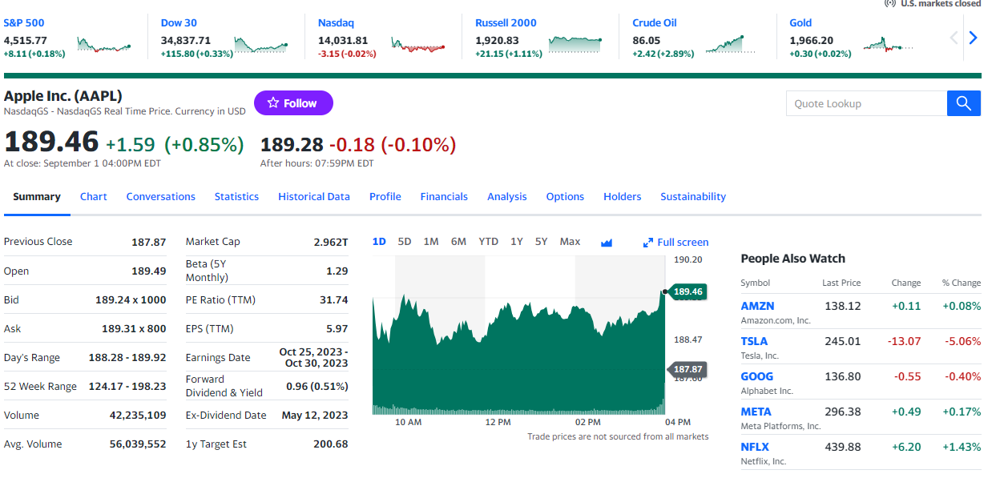

# Stock prediction

# Overview:
Stock values are particularly hard to predict due to its inherent volatility.
This project aims to predict stock prices using a deep machine learning model - 
Long Short-Term Memory (LSTM). 

## Technical Objective:
Predict stock prices 30 days into the future using deep learning neural network using Kera's API.

## Data source:
- yfinance library was used to retrieve historical stock prices

## Model implemented:
- **LSTM**

LSTM  is a recurrent neural network (RNN), designed to manage vanishing gradient problem
present in traditional RNNs. 
The idea behind this type of network is that it effectively learns which information 
might be needed and which can be ignored when predicting future values.

Some popular application os this LSTM are:
- speech recognition
- music composition
- weather forecasts
- stocks prediction

For further reading on LSTM access [Wikipedia's LSTM page](https://en.wikipedia.org/wiki/Long_short-term_memory)