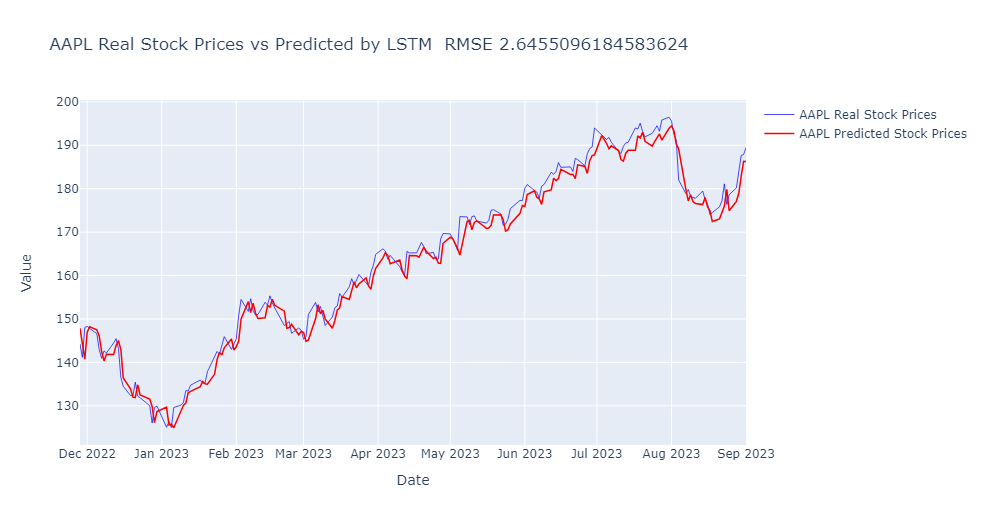
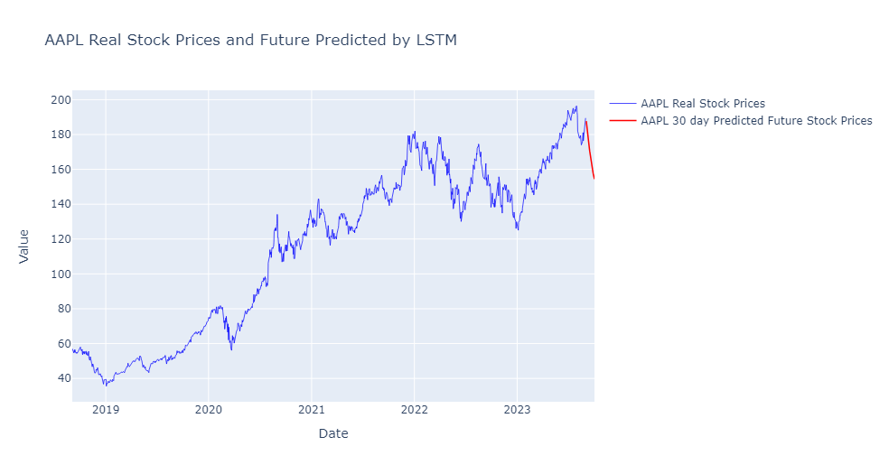

# Stock prediction using LSTM

# Overview:
Stock values are particularly hard to predict due to its inherent volatility.
This project aims to predict stock prices using a deep machine learning model - 
Long Short-Term Memory (LSTM). 

## Technical Objective:
Predict stock prices 30 days into the future for Apple, Amazon and Microsoft 
using deep learning neural network using Kera's API.

## Data source:
- yfinance library was used to retrieve historical stock prices

## Model implemented:
- **LSTM**

LSTM  is a recurrent neural network (RNN), designed to manage vanishing gradient problem
present in traditional RNNs. 
The idea behind this type of network is that it effectively learns which information 
might be needed and which can be ignored when predicting future values.

Some popular application os this LSTM are:
- speech recognition
- music composition
- weather forecasts
- stocks prediction

For further reading on LSTM access [Wikipedia's LSTM page](https://en.wikipedia.org/wiki/Long_short-term_memory)

## Results:
Using a very simple network architecture with two LSTm layers followed by two fully
connected dense layers to add some depth to the model. An EarlyStopping callback with 
a patience of 5 epochs was used to prevent overfitting. 

For example, Apple stocks' had a root mean squared error of just 2.64 over our test data

In terms of prediction into the future, the model relies on predicted values by our LSTM model
to input into the model again, so these are expected to have a higher absolute error.
Nonetheless, the model predicts a bullish moment for stock in the next 30 days.

